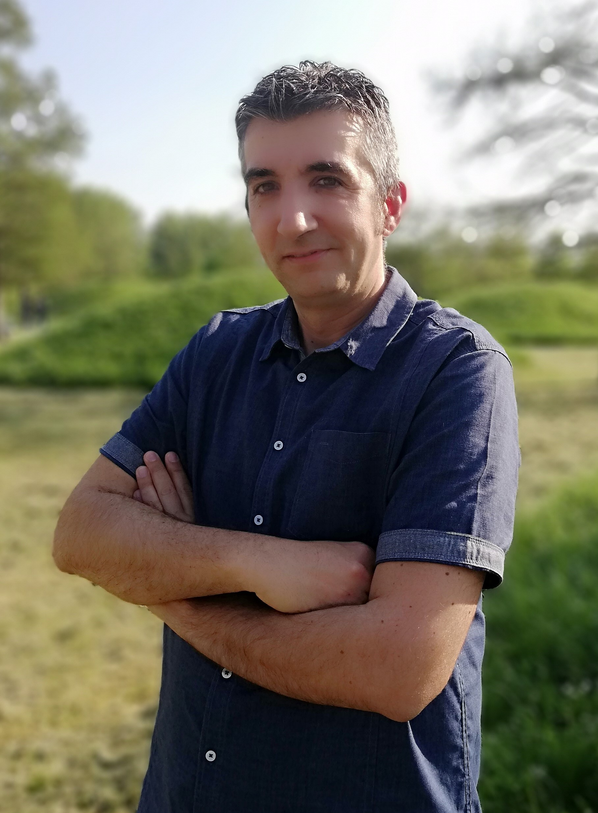

---
---

<link rel="stylesheet" href="styles.css" type="text/css">

Sono docente di corsi in ambito “Data Scientist” e “Data Mining” in possesso di approfondite conoscenze matematiche, statistiche e informatiche oltre a numerose specializzazioni acquisite nel campo dei processi di produzione e nelle scienze e tecnologie dei materiali. 

Sono docente, non ancora di ruolo, e insegno diverse discipline in ambito matematico-scientifico nelle scuole secondarie. Questa attività mi permette di focalizzarmi sulle tematiche legate ai processi di apprendimento (imparare ad imparare) e quelli cognitivi (trasformare le conoscenze in nuove competenze). 